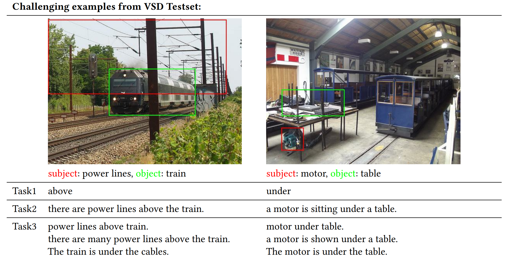
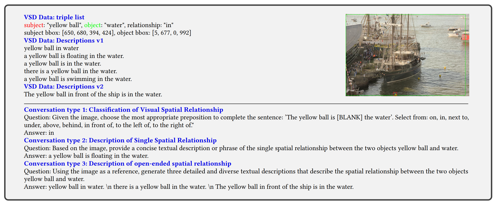
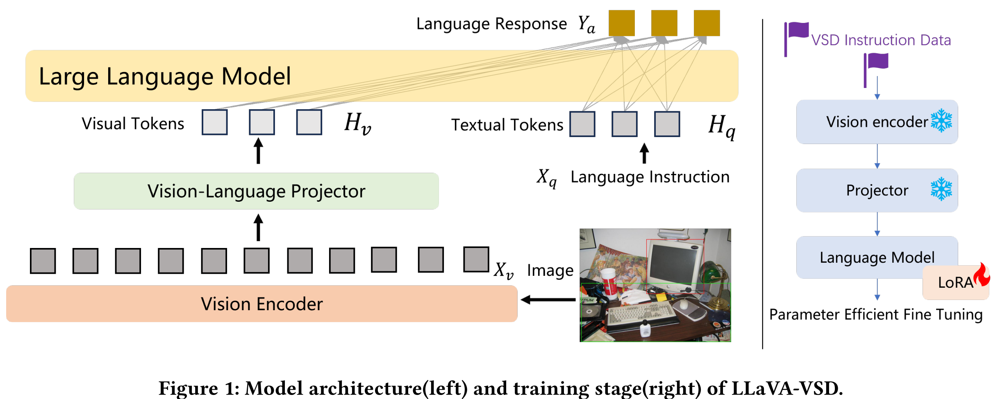

# LLaVA-VSD: Large Language-and-Vision Assistant for Visual Spatial Description

> **[LLaVA-VSD: Large Language-and-Vision Assistant for Visual Spatial Description](https://www.arxiv.org/pdf/2408.04957)**[ [arXiv]](https://www.arxiv.org/pdf/2408.04957) [ [huggingface]](https://huggingface.co/datasets/swordli/LLaVA-VSD-120K)

> *Yizhang Jin<sup>12</sup>, Jian Li<sup>1</sup>, Jiangning Zhang<sup>1</sup>, Jianlong Hu<sup>1</sup>, Zhenye Gan<sup>1</sup>, Xin Tan<sup>3</sup>, Yong Liu<sup>1</sup>, Yabiao Wang<sup>1</sup>, Chengjie Wang<sup>1</sup>, Lizhuang Ma<sup>2</sup>*

> *<sup>1</sup>Tencent YouTu Lab, <sup>2</sup>SJTU, <sup>3</sup>ECNU*

**⚡If you have any questions, please contact swordli@tencent.com. Welcome to collaborate on academic research and writing papers together.(欢迎学术合作)**. 

```
@article{jin2024llava,
  title={LLaVA-VSD: Large Language-and-Vision Assistant for Visual Spatial Description},
  author={Jin, Yizhang and Li, Jian and Zhang, Jiangning and Hu, Jianlong and Gan, Zhenye and Tan, Xin and Liu, Yong and Wang, Yabiao and Wang, Chengjie and Ma, Lizhuang},
  journal={arXiv preprint arXiv:2408.04957},
  year={2024}
}
```

## 📌 What is This paper About?

<p align="center">
    
</p>


Visual Spatial Description (VSD) aims to generate texts that describe the spatial relationships between objects within images. Traditional visual spatial relationship classification (VSRC) methods typically output the spatial relationship between two objects in an image, often neglecting world knowledge and lacking general language capabilities. In this paper, we propose a Large Language-and-Vision Assistant for Visual Spatial Description, named LLaVA-VSD, which is designed for the classification, description, and open-ended description of visual spatial relationships. Specifically, the model first constructs a VSD instruction-following dataset using given figure-caption pairs for the three tasks. It then employs LoRA to fine-tune a Large Language and Vision Assistant for VSD, which has 13 billion parameters and supports high-resolution images. Finally, a large language model  is used to refine the generated sentences, enhancing their diversity and accuracy. LLaVA-VSD demonstrates excellent multimodal conversational capabilities and can follow open-ended instructions to assist with inquiries about object relationships in images.

### Instruction-tuning Dataset
We release our instruction-tuning dataset **LLaVA-VSD-120K**, please visit [huggingface](https://huggingface.co/datasets/swordli/LLaVA-VSD-120K).
<p align="center">
    
</p>

### Architecture and Training
<p align="center">
    
</p>
